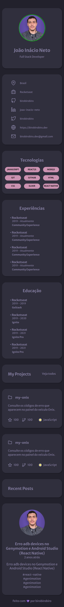
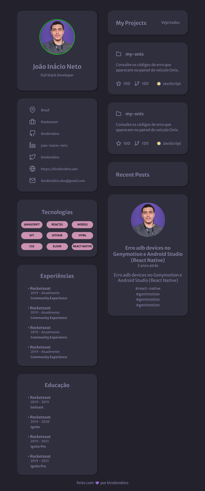
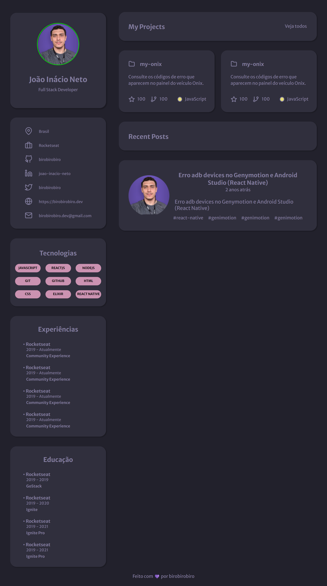

# Portfolio

## Projeto 💻
Projeto de um desafio da Rocketseat de criar uma página web para que seja seu portfolio e currículo.  
(https://www.figma.com/file/BVX3sg9Gdds802FdI40oOw/DD-%2F-Portfolio-(Copy)?t=Qa6L6WY6NwhVr3WT-6)

## Tecnologias 🚀
As tecnologias utilizadas neste projeto são:
- HTML
- CSS
- JavaScript
- React
- React DOM
- Testing Library
- React Scripts
- Web Vitals

## Créditos ❤️
Feito por [Millene Eduarda Ishiyama](https://github.com/miishiyama/).
