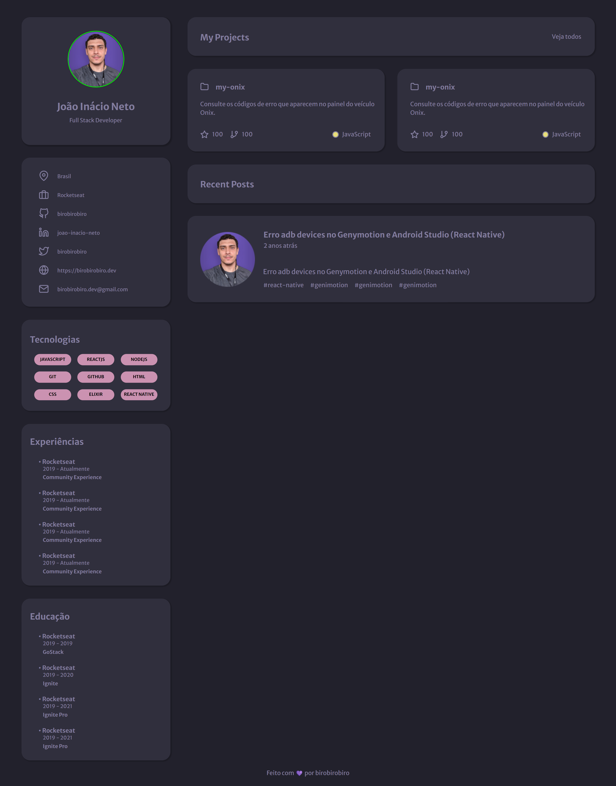

# Portfólio

  Preview:
    &nbsp;&nbsp;&nbsp;
  <a href="./preview/320x635">
    320x635
  </a>
    &nbsp;&nbsp;&nbsp;|&nbsp;&nbsp;&nbsp;
  <a href="./preview/768x635">
    768x635
  </a>
    &nbsp;&nbsp;&nbsp;|&nbsp;&nbsp;&nbsp;
  <a href="./preview/1024x635">
    1024x635
  </a>
    &nbsp;&nbsp;&nbsp;|&nbsp;&nbsp;&nbsp;
  <a href="./preview/1440x747">
    1440x747
  </a>

## Projeto 💻
Projeto de um desafio da Rocketseat de criar uma página web para que seja um portfólio e currículo.

## Layout 🔖
Segue abaixo o layout deste projeto:
- [Figma](https://www.figma.com/file/BVX3sg9Gdds802FdI40oOw/DD-%2F-Portfolio-(Copy)?t=Qa6L6WY6NwhVr3WT-6)

## Instalação 🛠
Siga esses passos para instalar o repositório na sua máquina:
1. Rode `git clone https://github.com/miishiyama/Portfolio` para fazer um clone desse repositório.
2. Rode `npm i` para instalar as dependências do projeto.
3. Rode `npm start` para iniciar o servidor de desenvolvimento.
4. Entre no link que aparecer no terminal.

## Tecnologias 🚀
As tecnologias utilizadas neste projeto são:
- HTML
- CSS
- JavaScript
- DOM
- React
- React DOM
- Testing Library
- React Scripts
- Web Vitals
- Media Queries
- Google Fonts

## Créditos ❤️
Feito por [Millene Eduarda Ishiyama](https://github.com/miishiyama/).
