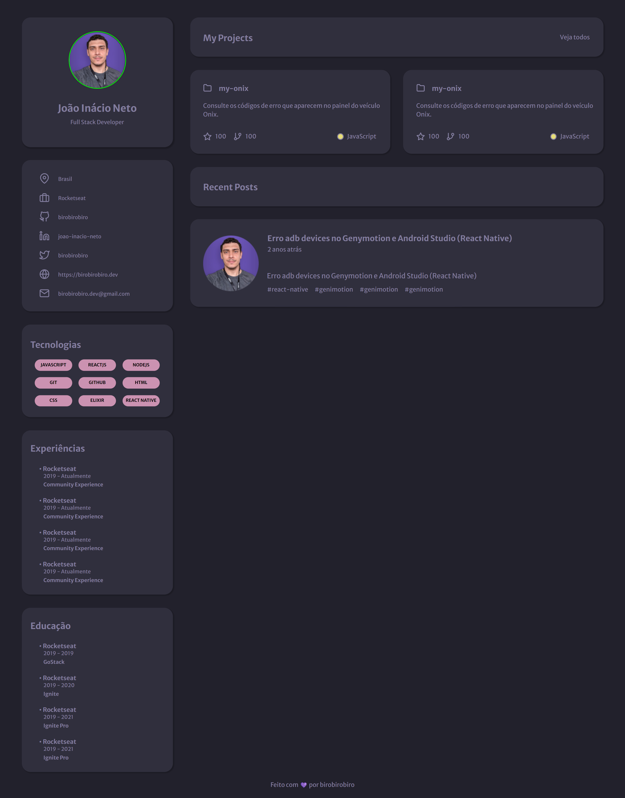

# Portfolio

  Preview:
    &nbsp;&nbsp;&nbsp;
  <a href="./preview/Portfolio-320x635.png">320x635</a>
    &nbsp;&nbsp;&nbsp;|&nbsp;&nbsp;&nbsp;
  <a href="./preview/Portfolio-768x635.png">768x635</a>
    &nbsp;&nbsp;&nbsp;|&nbsp;&nbsp;&nbsp;
  <a href="./preview/Portfolio-1024x635.png">1024x635</a>
    &nbsp;&nbsp;&nbsp;|&nbsp;&nbsp;&nbsp;
  <a href="./preview/Portfolio-1440x747.png">1440x747</a>

## Projeto 💻
Projeto de um desafio da Rocketseat de criar uma página web para que seja um portfolio e currículo.  
(https://www.figma.com/file/BVX3sg9Gdds802FdI40oOw/DD-%2F-Portfolio-(Copy)?t=Qa6L6WY6NwhVr3WT-6)

## Instalação 🛠
Siga esses passos para instalar o repositório na sua máquina:
1. Rode `git clone https://github.com/miishiyama/Portfolio` para fazer um clone desse repositório.
2. Rode `npm i` para instalar as dependências do projeto.
3. Rode `npm start` para iniciar o servidor de desenvolvimento.

## Tecnologias 🚀
As tecnologias utilizadas neste projeto são:
- HTML
- CSS
- JavaScript
- React
- React DOM
- Testing Library
- React Scripts
- Web Vitals

## Créditos ❤️
Feito por [Millene Eduarda Ishiyama](https://github.com/miishiyama/).
